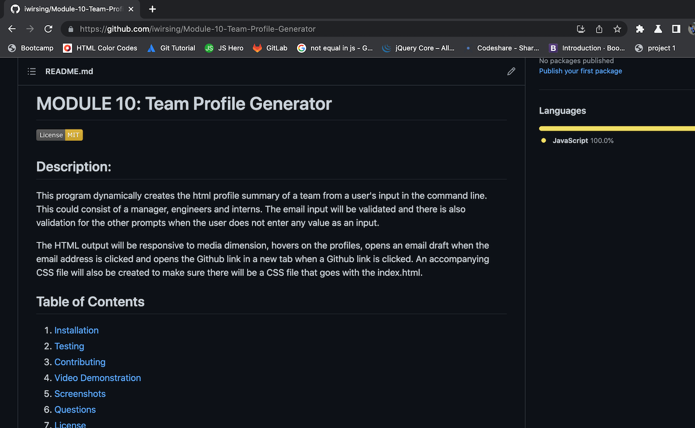
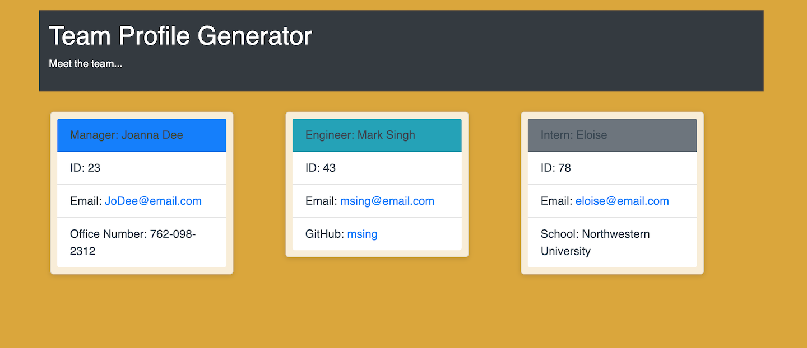
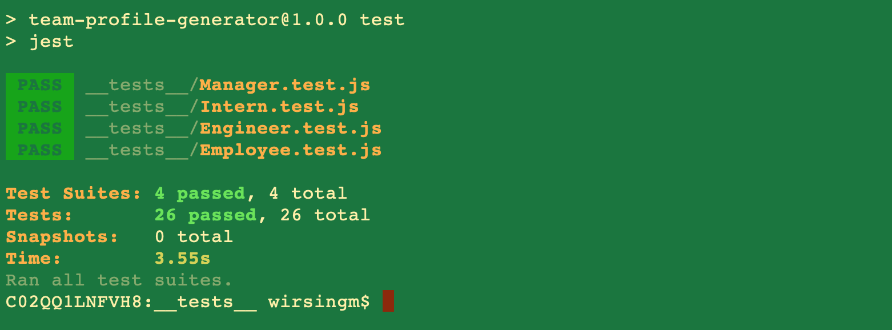

# MODULE 10: Team Profile Generator

##  Description:

This program dynamically creates the html profile summary of a team from a user's input in the command line. This could consist of a manager, engineers and interns. The email input will be validated and there is also validation for the other prompts when the user does not enter any value as an input.

The HTML output will be responsive to media dimension, hovers on the profiles, opens an email draft when the email address is clicked and opens the Github link in a new tab when a Github link is clicked. An accompanying CSS file will also be created to make sure there will be a CSS file that goes with the index.html.

##  Table of Contents 
1. [Installation](#installation)
2. [Testing](#test) 
3. [Contributing](#contributing)
4. [Video Demonstration](#test)
5. [Screenshots](#screenshots)
6. [Questions](#questions)
7. [License](#license)
8. [Sources](#sources)

## Installation

1. First, download the files to a folder. 
2. Then go to the root folder of the downloaded project and open the folder in the terminal.
3. Next, type `npm install` to install all the dependencies.
4. Afterwards, type `node index.js` to run the program. 
5. The user then types the answers corresponding to the prompts in the terminal. 
6. When the prompts and answering are done, `index.html` and `style.css` are generated in the `dist` folder. 
7. Finally, view the html in the browser to see the final HTML.

## Testing

1. Open the `__test__` folder in the command line.
2. Type and `npm test`. This will run Jest to test the class constructors.

## Contributing 

Ask permission from the author at ivymolina@gmail.com. View more of my projects at https://github.com/iwirsing. 

## Video Demonstration
Screencastify:

## Screenshots

Generated index.html:

Tests results:

## Questions? 

Please contact me through any of the following:

1. My [Github](https://github.com/iwirsing).
2. Email: <a href="mailto:ivymolina@gmail.com">ivymolina@gmail.com</a>

## License

The project in covered under the [MIT](https://opensource.org/licenses/MIT) license.

## Sources
1. https://stackoverflow.com
2. https://getbootstrap.com/
3. Tutor: Geronimo Perez

